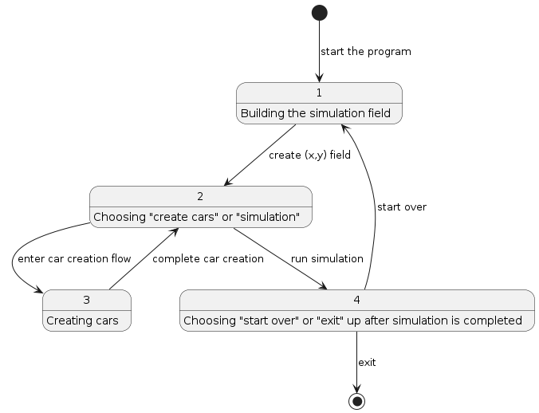

# Prerequisite
```
python >= 3.7
```

# Run
```
python -m src.main
```

# Assumptions
1. Cars do not collide when a step is being executed halfway, e.g., a car located at (0,0) moving to east does not
collide with a car located at (1,0) moving to west.

2. A car can collide with a car which has already been collided with other cars.

3. Unlimited number of cars can collide at the same coordinate at the same time.

4. Allow cars with duplicated names.

5. Cars which have not collided yet continue to execute commands even if some other cars have already collided. In another word, simulation ends only when every car completes its commands or has collided.

# Design

## State machine
The execution flow of the program is basically a state machine which consists of following states.

1. Building the simulation field
2. Choosing "create cars" or "simulation"
3. Creating cars
4. Choosing "start over" or "exit" up after simulation is completed

The state transition is illustrated in the following diagram.



The `main.py` basically implements the above state machine.

## Car creation
The car creation flow itself is a much lesser complicated state machine. The completed flow translates into a `Car` object, illustrated in `car.py` and `car_creator.py`.

## Simulation
The simulation basically moves every single car except for collided ones one step per iteration. At the end of an iteration, it detects collision via grouping cars by coordinate using a hash map. The car groups with more than one car indicate collisions and those cars are marked as collided.

At the end of the simulation, we group all cars by coordinate again to derive for every single collided car, which cars are involved in the collision.

## Error handling
Error handling involves a few aspects.

1. Input is ill-formatted, e.g., coordinates cannot be parsed to integers, direction is not in "NESW", command is not in "LRF", etc.
2. Car coordinates are out of the field.
3. Car coordinates are duplicated. Though strictly speaking, this is not treated as an error in the program; instead they are considered collided at step 0.

## Testing
1. Testing mostly follows Google's "testing on the toilet" principles, e.g., prefer production implementation over mock instances, test public APIs, test a single behaviour per test case, etc.
2. 100% unit test coverage for major business classes and functions.
3. No end-to-end tests were created due to limited time. If I had more time, an end-to-end test can be created to pipe presets of texts to the program's stdin and verify the contents in its stdout.